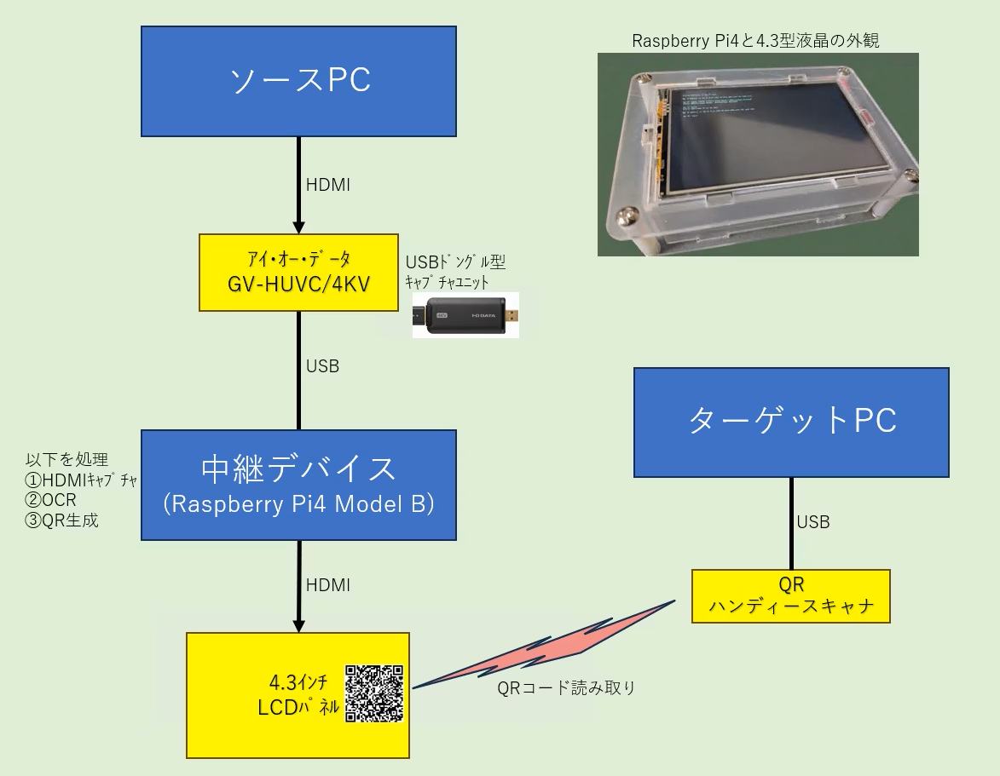

# video2qr

Raspberry PiでHDMI出力をキャプチャし、OCRで文字列を抽出してQRコードとして小型液晶に表示するシステムです。

USBメモリ・ネットワーク・Bluetoothといった一般的なデータ転送手段が封じられているエアギャップ環境での利用を想定しています。

## 背景

大量のPCキッティング現場では、1台ずつユニークな60文字以上のライセンスコードを画面から手入力するケースがあります。ミスが出れば入力し直し、何百台とこなすのはなかなかタフな作業です。しかもネットワーク接続もUSBメモリも使えない環境となると、手軽な解決策がなかなか見当たりません。

そこで「HDMIで画面を取り込んでQRコード化してしまえばいいのでは」という発想で作ったのが本システムです。

---

## 仕組み

```
[ソースPC] --HDMI--> [キャプチャデバイス] --USB--> [Raspberry Pi]
                                                         |
                                                  OCR + 正規表現マッチ
                                                         |
                                                  液晶にQRコード表示  <- 作業員がスキャン -+
                                                                                          |
                               [ターゲットPC] <-- QRハンディスキャナ（HIDデバイス） -------+
```



USB型HDMIキャプチャデバイスを経由してソースPCの画面をRaspberry Piに取り込みます。キーを1つ押すと1フレームキャプチャ -> OCR -> `menu.json`に定義した正規表現でターゲット文字列を抽出 -> QRコードとして全画面表示、という流れで動作します。ターゲットPCに接続したQRハンディスキャナはHIDデバイスとして認識されるため、ドライバのインストールは不要です。

## ハードウェア要件

- Raspberry Pi 4 Model B
- UVC対応USB型HDMIキャプチャデバイス（動作確認機種：アイ・オー・データ GV-HUVC/4KV）
- MicroHDMI接続の小型液晶（動作確認：4.3インチ FullHD、MicroHDMI直接接続タイプ。MIPI-DSIタイプは未検証）
- QRハンディスキャナ（HIDデバイス）

## 液晶ディスプレイについて

作者の動作確認環境は4.3インチのFullHD液晶です。小型液晶にFullHD解像度を出力すると、デフォルトのコンソールフォントは非常に小さく表示されます。そのため、セットアップスクリプトでは`fbterm`のフォントサイズを48に設定しています（`fbterm -s 48`）。液晶のサイズや解像度によって最適値は異なりますので、`setup/06_autostart.sh`の該当箇所を適宜調整してください。

QRコードの密度についても制約があります。小型液晶でQRコードのモジュール（点）が細かくなりすぎるとスキャナが読み取れなくなるため、本システムでは抽出文字列の上限を60～120文字程度（デフォルト128文字）に制限しています。より大きな液晶を使用する場合はこの制限を緩和できます。`ocr2qr.py`の`QR_MAX_LEN`を変更してください。

## ソフトウェア要件

- Raspberry Pi OS Lite 64-bit（動作確認：Debian GNU/Linux 13 trixie、カーネル 6.12.75+rpt-rpi-v8）
- セットアップ時のみインターネット接続が必要です

## セットアップ

Raspberry Pi上でリポジトリをcloneし、セットアップスクリプトを実行します。

```bash
git clone https://github.com/Takuya-Fuzita/video2qr.git
cd video2qr
sudo chmod +x setup.sh
./setup.sh
sudo reboot
```

起動直後にロケール設定の選択を求められます。日本語環境（`LANG=ja_JP.UTF-8`・CJKフォント）が必要かどうかの選択であり、アプリの表示言語が切り替わるわけではありません。reboot後、tty1でメニューが自動起動します。

> `user01`は`--disabled-password`で作成されるため、パスワードによるSSHログインは無効になっています。必要な場合は`sudo passwd user01`でパスワードを設定してください。ユーザー名を変更したい場合は`setup/common.sh`の`APP_USER`を編集してください。

## 抽出パターンのカスタマイズ

`menu.json`を編集することでメニュー項目の追加・変更ができます。Pythonコードの修正は不要です。

```json
{
    "menu_items": [
        {
            "key": "1",
            "label": "63文字の数字を抽出する",
            "pattern": "(?<!\\d)\\d{63}(?!\\d)"
        }
    ]
}
```

## ハッシュ検証

QRコードの横にSHA-256ハッシュの末尾5文字を表示します。ソースPC側でも同じハッシュを計算できる環境であれば、転記が正しかったかを目視で確認できます。

```powershell
$str = "（対象の文字列）"
$sha256 = [System.Security.Cryptography.SHA256]::Create()
$bytes = [System.Text.Encoding]::UTF8.GetBytes($str)
$hex = [BitConverter]::ToString($sha256.ComputeHash($bytes)) -replace "-", ""
$hex.Substring($hex.Length - 5)
```

5文字（16進数）が偶然一致する確率は約100万分の1です。暗号学的な保証ではなく、あくまで目視確認の補助として使ってください。

## 動作の様子


## 既知の制限事項

OCRの精度が実用上の最大の障壁です。

**Cascadia Codeフォント**（コマンドプロンプトのデフォルト）は認識率が低く、ゼロを`6`と誤認識するケースが多く見られました。

**Windows Script Hostダイアログ**（例：`slmgr.vbs`）はフォントがSegoe UIで固定されており、画像を拡大しても安定した認識が得られませんでした。

**数字列の折り返し**についても、ダイアログ内で2行に分かれて表示される場合は正規表現がマッチしません。

Cascadia Codeのカスタム学習データでファインチューニングを行ったところ精度は大幅に改善しましたが、処理時間がRaspberry Pi 4で1分以上かかるようになりました（メモリではなくCPUがボトルネック）。前処理（二値化・拡大率の調整など）の工夫次第では改善できる可能性があります。改善情報のPRやコメントを歓迎します。

## 検討したが採用しなかった方法

**ソースPC上でQRコード化スクリプトを動かす案**：ソースPCへのUSBデバイス接続やサードパーティ製実行ファイルの持ち込みも制限されている現場が多いと考え、早い段階で除外しました。

**Raspberry Pi ZeroをHIDデバイスとして使う案**：OS起動前に謎のUSBデバイスとして認識される懸念があり、検証コストが高いため除外しました。

## 一応言っておくと

仕組みとしては「画面の内容を外部デバイスに取り出す」システムなので、広い意味ではデータの持ち出しツールと言えなくもありません。まあこんなものをガチのビジネス用途で使う人がいるとは思えませんが、万が一使う場合は会社のセキュリティポリシーや社内規定に従ってください。

また、**パスワードの入力やBitLockerなどの回復キーの転記・バックアップには使用しないでください。** これらは誤りがあった場合に極めて深刻な結果をもたらします。ハッシュ値を過信しないでください。入力側でペナルティのないバリデーションが担保されているケース（例：ライセンスコードの認証）においてのみ使用してください。

## 商標について

QRコードはデンソーウェーブ株式会社の登録商標です。

## ライセンス

MIT
