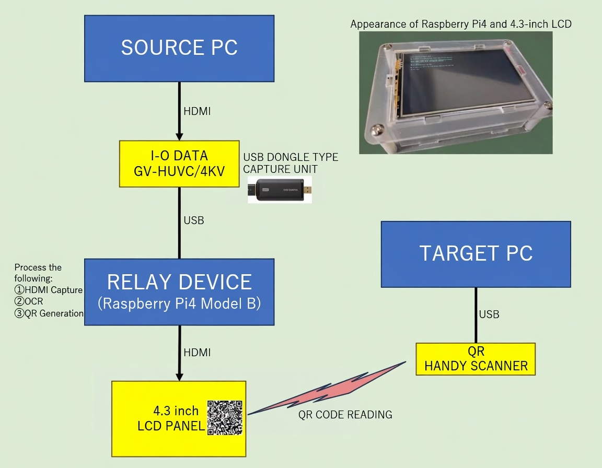
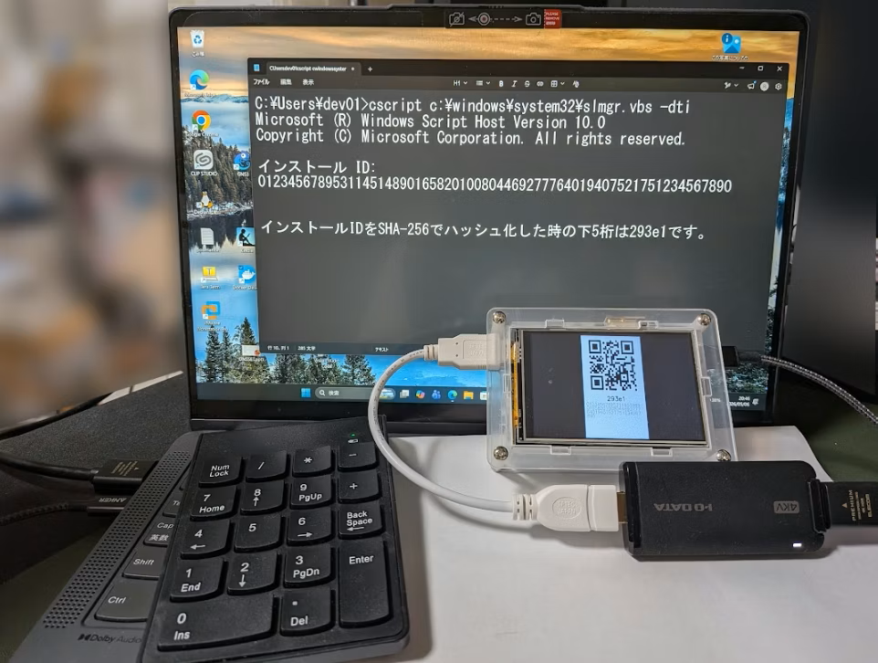

# video2qr

Captures an HDMI output, extracts a target string via OCR, and displays it as a QR code on a small LCD — all on a Raspberry Pi.

Designed for air-gapped environments where USB drives, network connections, and other common data transfer methods are not available.

## Background

In large-scale PC provisioning work, operators sometimes have to manually type in license codes of 60+ characters — one unique code per machine, one machine at a time. Miss a character and you type it again. Do that hundreds of times and it gets old fast.

This gets even harder when the target PCs are air-gapped, leaving no easy way to automate the transfer. This project started as an attempt to take some of that pain away.

---

## How it works

```
[Source PC] --HDMI--> [Capture device] --USB--> [Raspberry Pi]
                                                      |
                                               OCR + regex match
                                                      |
                                               QR code on LCD  <- operator scans -+
                                                                                   |
                              [Target PC] <-- HID QR scanner --------------------+
```



A USB HDMI capture device feeds the source PC's screen into the Raspberry Pi. One keypress captures a single frame, runs OCR, extracts the target string using a regex pattern defined in `menu.json`, and displays the result as a full-screen QR code. A QR handheld scanner connected to the target PC reads it as keyboard input — no drivers needed.

## Hardware requirements

- Raspberry Pi 4 Model B
- UVC-compatible USB HDMI capture device (tested with I-O DATA GV-HUVC/4KV)
- Small LCD display connected via MicroHDMI (tested with 4.3 inch Full HD, direct MicroHDMI type — MIPI-DSI untested)
- QR handheld scanner (HID device)

## Notes on LCD display

The author's environment uses a 4.3 inch Full HD LCD. At that resolution, the default console font appears extremely small. The setup script sets the `fbterm` font size to 48 (`fbterm -s 48`). Adjust this value in `setup/06_autostart.sh` to suit your display.

QR code density is also a factor. On a small LCD, a dense QR code becomes unreadable for most scanners. For this reason the system limits extracted strings to roughly 60–120 characters (default: 128). If you use a larger display you can raise this limit by changing `QR_MAX_LEN` in `ocr2qr.py`.

## Software requirements

- Raspberry Pi OS Lite 64-bit (tested on Debian GNU/Linux 13 trixie, kernel 6.12.75+rpt-rpi-v8)
- Internet connection required during setup only

## Setup

Clone this repository on the Raspberry Pi and run the setup script.

```bash
cd /usr/local/bin/
git clone https://github.com/Takuya-Fuzita/video2qr.git
cd video2qr
sudo chmod +x setup.sh
./setup.sh
sudo reboot
```

At the start, the script asks whether you need Japanese locale settings (`LANG=ja_JP.UTF-8` and CJK fonts). This does not change the display language of the app itself. After reboot, the menu launches automatically on tty1.

> `user01` is created with `--disabled-password`, so password-based SSH login is disabled by default. If needed, run `sudo passwd user01` to set a password. To use a different username, edit `APP_USER` in `setup/common.sh`.

## Customizing extraction patterns

Edit `menu.json` to add or change the strings you want to extract. Each item needs a label and a regex pattern.

```json
{
    "menu_items": [
        {
            "key": "1",
            "label": "Extract 63-digit number string",
            "pattern": "(?<!\\d)\\d{63}(?!\\d)"
        }
    ]
}
```

Menu items are automatically reflected without changing any Python code.

## Hash verification

After scanning, a 5-character SHA-256 suffix is displayed alongside the QR code. If the source PC can compute the same hash independently, you can visually confirm the transfer was correct.

```powershell
$str = "(your string)"
$sha256 = [System.Security.Cryptography.SHA256]::Create()
$bytes = [System.Text.Encoding]::UTF8.GetBytes($str)
$hex = [BitConverter]::ToString($sha256.ComputeHash($bytes)) -replace "-", ""
$hex.Substring($hex.Length - 5)
```

The collision probability is approximately 1 in 1,000,000. Treat it as a visual sanity check, not a cryptographic guarantee.

## In action



## Known limitations

OCR accuracy is the main obstacle to practical use.

- **Cascadia Code** (Windows Terminal / Command Prompt default): recognition rate is low. Zero is frequently misread as `6`.
- **Windows Script Host dialogs** (e.g. `slmgr.vbs`): the font is small and fixed to Segoe UI, which Tesseract struggles with even after upscaling.
- **Wrapped number strings**: if the target string wraps across two lines in a dialog, the current regex will not match.

Fine-tuning Tesseract with a custom Cascadia Code dataset improved accuracy significantly, but processing time increased to over one minute on Raspberry Pi 4 (CPU-bound, not memory-bound). This makes it impractical for production use.

Pre-processing tweaks (binarization, upscale ratio) may improve results depending on your environment. Contributions are welcome.

## Workarounds considered but not implemented

- Running the QR generation script directly on the source PC: excluded because many environments also restrict USB device connections and third-party executables on the source PC.
- Using Raspberry Pi Zero as a HID device: excluded due to uncertainty around OS recognition before boot completes.

## A small note

At its core, this system captures screen content and moves it to an external device — which, depending on how you look at it, is a form of data exfiltration. Honestly I can't imagine anyone deploying this in a serious business environment, but if you do, please make sure it aligns with your company's security policies and internal guidelines.

Also, **do not use this tool for entering passwords or transferring/backing up recovery keys such as BitLocker.** A mistake in those cases can have extremely serious consequences. Do not place too much trust in the hash verification. Only use this tool where the receiving side provides penalty-free validation — for example, license code activation that simply rejects incorrect input without locking anything out.

## Trademark

QR Code is a registered trademark of DENSO WAVE INCORPORATED.

## License

MIT
